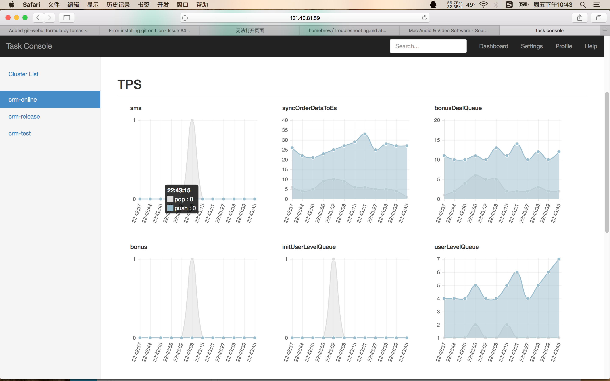

## 概述

适用于java项目中需要异步处理、批量处理、任务调度等业务处理场景 

### 设计模型
* task-queue【任务中心】：任务管理容器，基于redis list数据结构实现的任务队列，目前队列只支持FIFO消费模式 
* router【路由器】：任务分发器,负责调度任务容器中task给worker去执行，并协调系统中router和worker的执行，监控worker的状态，异常情况 
* worker【任务执行者】：实际任务执行者，负责执行router下发的任务，并在任务执行完毕后可以通知router，等待下一次任务的调度 
* taskContainer【任务容器】：我们把这3个角色合起来称之为任务容器，它对我们开发人员是完全透明，在使用时，我们不必关系这些3个角色，只需要把你要做的事情告诉任务容器，任务容器负责整个任务中心的调度，负载，异常处理。 

### 使用

##### 1. 加入下面依赖

        <dependency> 
                <groupId>cn.edaijia</groupId> 
                <artifactId>queue-service</artifactId> 
                <version>1.0-SNAPSHOT</version> 
        </dependency>
        
##### 2. 配置

> 在项目的resource目录的根目录下加入配置文件：queueService.conf，配置内容如下 

         QueueService{ 
         
             # 使用版本号，目前版本只支持1.0 
             version = 1.0 
         
             # 使用服务的项目名，主要用来防止和别的项目在使用redis 队列时有同名冲突 
             ProjectName:crmWeb 
         
             # 需要用到的队列，实际在redis中创建的队列名是queueName_ProjectName 
             QueueList:[userLevelAnay,userBasicSync] 
         
             # 任务分发器的个数
             router:2 
         
             # 实际任务执行者的个数
             worker:6 
         
             # 具体业务处理类，业务的入口 
             ProcessQueueClass:"cn.edaijia.crm.task.ProcessQueue" 
         
             # 监控队列积压情况，报警
             alertPhone:"15652636152,13426031637,13810759781,18202794850"
         
         } 

##### 启动

一、 web容器中，容器初始化过程中，运行下面code：

        QueueServiceStart.setSystem(AkkaSystem.system); 
        QueueServiceStart.run(); 

> 如果启动后看到下面这些配置，说明启动成功
 
        INFO ]  {QUEUE.SERVICE:86}-------------queueService load conf------------------------- 
        INFO ]  {QUEUE.SERVICE:87}-projectName:crmWeb 
        INFO ]  {QUEUE.SERVICE:88}-dispatchParallel:2 
        INFO ]  {QUEUE.SERVICE:89}-execParallel:2 
        INFO ]  {QUEUE.SERVICE:90}-maxParallel:12 
        INFO ]  {QUEUE.SERVICE:91}-queueList:[userLevelAnay, userBasicSync, bonusDealQueue, orderDataToEs] 
        INFO ]  {QUEUE.SERVICE:92}-processQueueClass:cn.edaijia.crm.task.ProcessQueue 
        INFO ]  {QUEUE.SERVICE:93}-------------------------------------- 

二、如果不想依赖web程序，只是单独的jar文件，你可以直接通过程序入口启动：

程序入口：`cn.edaijia.queue.Main `

##### 添加任务

>如果你想把自己的业务处理放入到任务容器，你需要的做的事情
 
>* No.1 业务处理入口：在上文配置文件指定的ProcessQueueClass位置编写你的业务入口方法，若想给该方法传参，只支持Map型参数。 
>* No.2 提交到任务容器：提交任务只需要一条code，Task task = new Task(queueName,methodName,params);此时task会返回给你一个task.id，你最好把该id用log记录起来，后文会提到 

比如在ProcessQueue有一个名为test的业务入口

        public class ProcessQueue {
        
            Logger logger = LoggerFactory.getLogger(getClass());
        
            public void test(Map params) {
                try {
                    Thread.sleep(1000);
                } catch (InterruptedException e) {
                    e.printStackTrace();
                }
                logger.info("hello world ");
            }
        }
        
提交名为test的业务
        
      Task task = new Task(queueName,test,params);
        
        
##### ok，到目前的介绍，你应该可以把程序启动了，处理你的业务了 

 
##### 任务调度
> 任务调度是该框架的另一个功能，主要是为了弥补spring的job不足的地方，利用该框架，你可以根据自己的需要通过程序随意的启动取消一个job

           // 新建一个job,名为test 
           EdaijiaJob.newJob("test", new Job() {
    
                       @Override
                       public void logic() {
                           Util.report("hello world");
                       }
                   }
           );
           // 立马执行名为test的job一次
           EdaijiaJob.scheduleOnce(0,TimeUnit.SECONDS,"test");
           // 立马执行名为test的job，每隔一秒执行一次
           EdaijiaJob.schedule(scala.concurrent.duration.Duration.Zero(),1, TimeUnit.SECONDS, "test");
           try {
               Thread.sleep(3000);
           } catch (InterruptedException e) {
               e.printStackTrace();
           }
           //取消名为test的job
           EdaijiaJob.cancel("test");

##### 任务调度，负载，与异常处理

1. 调度：
> router会负责监控任务容器中提交的任务，当router发现有新任务时会立马把任务push给worker，worker通过解析Task对象，可以找到对应的ProcessQueueClass中的业务入口方法和需要的参数，然后执行，执行完毕后worker会告知router，任务已完成，等待下次任务的下发 ，
> 比如你配置了2个router和6个worker，每个router下就会有6个worker，router会监控worker的工作状态并根据worker转态是否是空闲来下发任务，假如当前worker都处于空闲状态，任务容器中已经积压了很多task，每个router便可同时下发6个任务分别给6个worker

1. 负载、集群、扩容：
> 任务容器会管理着所有业务提交的task到queue-task中，假如集群中一个节点提交任务到任务容器中，集群中每个节点都有可能去处理它，这样系统的负载完全是一种随机的方案，按概率来说每个节点获得处理一个任务的机会是等同的，鉴于这点
，假设当前系统各个业务提交任务的并发量很大，如果任务容器处理任务出现积压，我们便可横向扩展我们的机器，增加集群节点去处理容器中的任务。

1. 异常处理
> 业务方在在编写自己的业务处理代码时，可以不必考虑异常是否可不可以抛出到任务容器中，worker在执行业务方的逻辑时，如果发生异常，worker会记录异常信心到日志文件中，你可以通过
 task对象给你返回的task.id去追踪异常信息，同时router发现worker抛出异常，router会重启router进行下一个任务的处理

##### 监控

1. currentPressure:当前任务容器处理任务的系统的压力，最大值为1，表示系统已经火力全开，达到最大处理速度
1. commitTaskCount：监测节点已经往任务容器提及的任务数
1. maxParallel:当前节点系统批处理能力的最大值，比如下面，代表可以同时处理12个任务
1. 队列任务：代表当前节点中用到的队列有哪些以及每个队列积压的任务数

